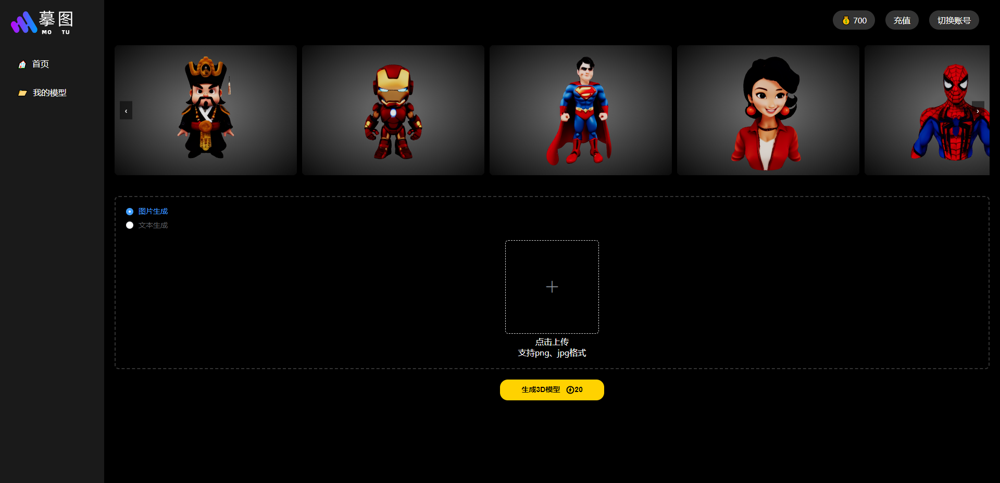
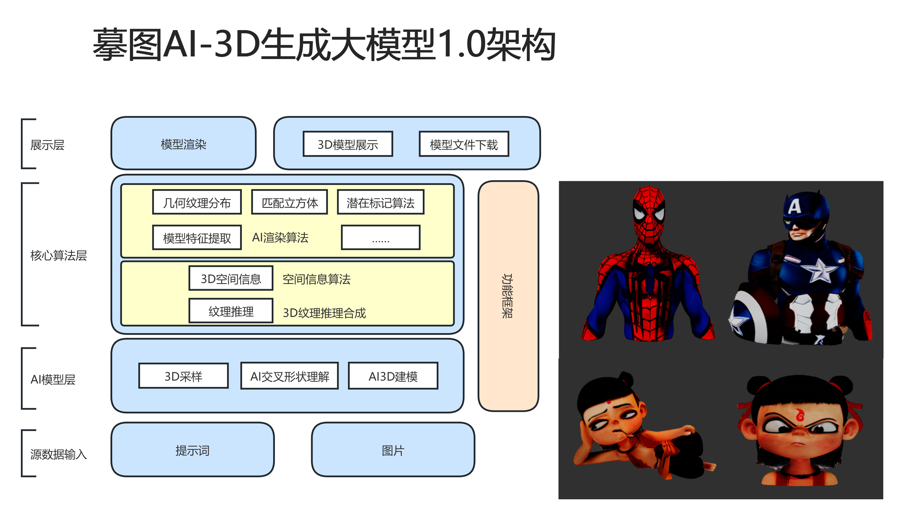
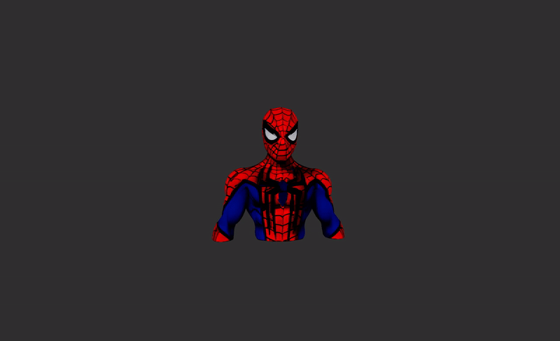
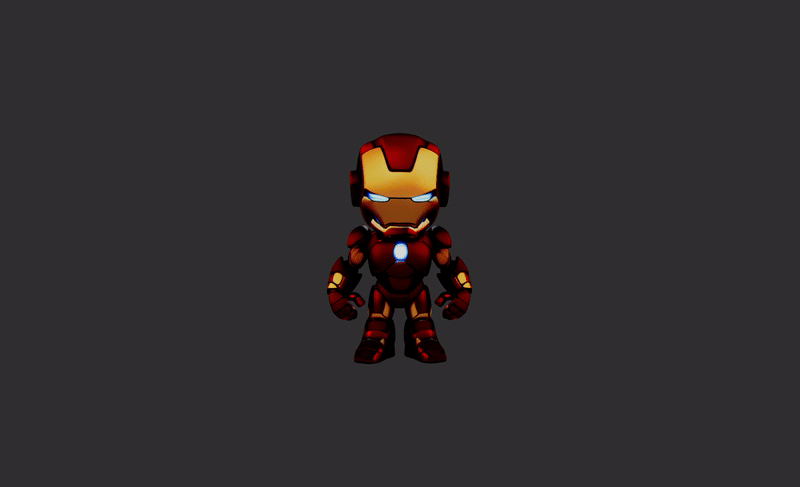
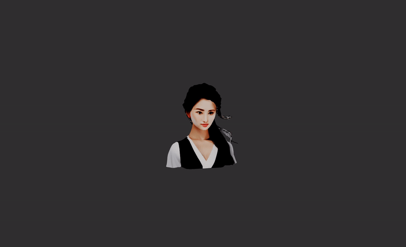
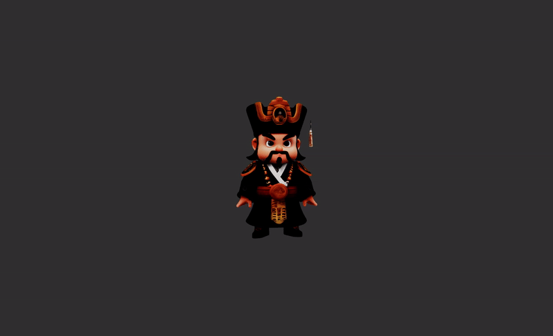

# 摹图3D模型

摹图3D模型是一个基于 Node.js 的 3D 模型生成工具，支持通过输入文字或上传图片，快速生成高质量的 3D 模型。模型可在网页端实时预览，并支持下载为 `.glb` 格式，方便在其他 3D 软件或 Web 应用中使用。




## 🏗 系统架构


## ✨ 主要特性
- **支持主流图片格式**：兼容 `.png` 和 `.jpg` 图片上传。
- **文本驱动生成**：输入文字，即可生成相关 3D 模型。
- **快速生成**：优化的渲染与生成流程，大幅减少等待时间。
- **在线预览**：支持 Web 端 3D 交互预览，无需额外安装软件。
- **一键下载**：生成的 3D 模型可下载为 `.glb` 格式，方便集成至其他应用。

## 🛠 安装指南

本项目是基于 Node.js 的服务端应用，安装与运行十分简单。

### 1. 先决条件
- **Node.js** (建议使用 v14+)
- **Git**

### 2. 下载与安装
1. 克隆项目代码：
   ```sh
   git clone https://github.com/chenfuzhenxing/MoTuAI-3d.git
   cd MoTuAI-3d
   ```
2. 安装依赖：
   ```sh
   npm install
   ```
3. 运行应用：
   ```sh
   node server.js
   ```
4. 在浏览器中访问 `http://localhost:8081

## 🚀 使用方法

### 方式 1：图片生成 3D 模型
1. 访问 `http://localhost:8081
2. 上传 `.png` 或 `.jpg` 图片
3. 点击“生成3D模型”按钮，等待模型生成
4. 等待生成并查看 3D 模型
5. 单击进入展示页面
6. 可下载 `.glb` 文件以便后续使用

### 方式 2：文本生成 3D 模型
1. 进入主页
2. 在文本框中输入描述性文字（例如：“一座未来科技风格的建筑”）
3. 点击“生成3D模型”按钮
4. 等待生成并查看 3D 模型
5. 单击进入展示页面
6. 可下载 `.glb` 文件以便后续使用

## 🎥 演示效果


<div align="center">
  <div style="display: flex; justify-content: center; gap: 20px;">
    
    
  </div>
  <br />
  <div style="display: flex; justify-content: center; gap: 20px;">
    
    
  </div>
</div>


### 📌 开源计划

- ✅ **前端和渲染展示工具**
- ⬛ **API 接口**
- ⬛ **推理模型**

## 🤝 贡献指南
目前暂不接受外部贡献，但后续可能开放贡献通道。敬请关注。

## 📜 许可证
本项目采用 MIT 许可证，详细信息请查看 [LICENSE](LICENSE) 文件。

## 💼 商业合作


---
如果你在使用过程中遇到任何问题或有建议，欢迎提交 Issue！

